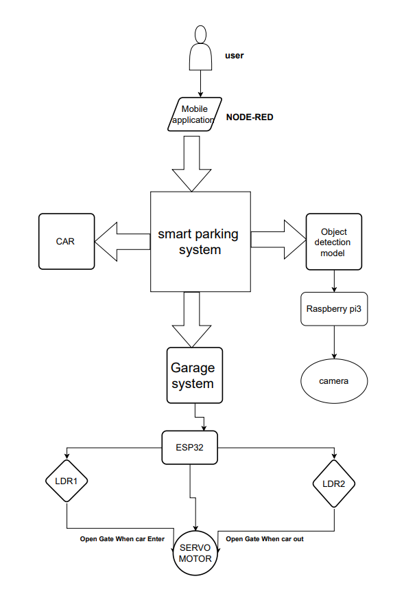
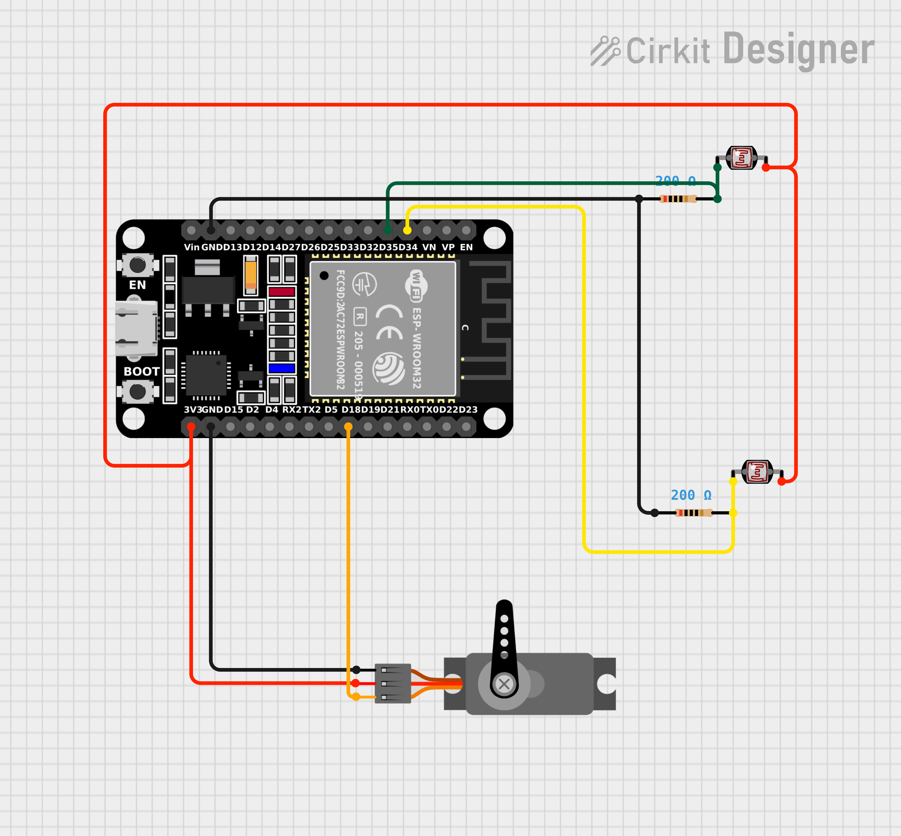
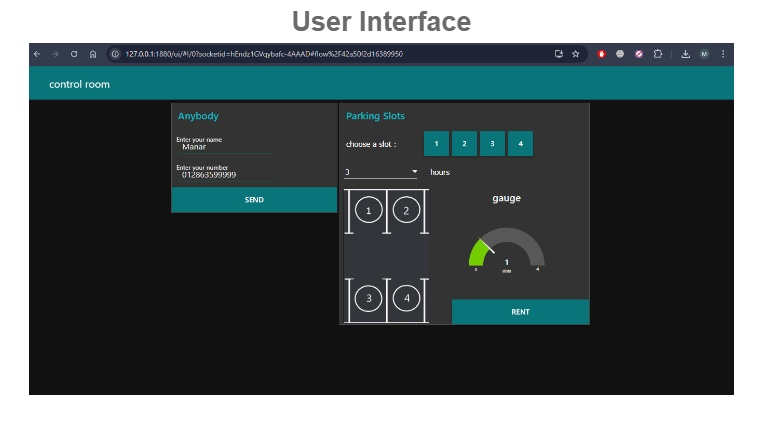

# Valet Parking Application - SIC601 - GP2

## **Table of Contents**
1. [Overview](#overview)
2. [Garage System](#garage-system)
   - [Gate Control System](#gate-control-system)
   - [Car Detection](#car-detection)
   - [Parking Slots Management](#parking-slots-management)
   - [Node-RED Integration](#node-red-integration)
   - [MQTT Communication](#mqtt-communication)
   - [Automation and Flow](#automation-and-low)
   - [Flow Chart and Circuit Diagram](#wiring)
3. [Car Parking and Unparking System](#car-parking-and-unparking-system)
	- [System Components](#system_components)
	- [Sensors and Modules](#sensors-and-modules)
	- [ESP32 Communication Module](#ESP32-Communication-Module)
	- [Motion Control](#motion-control)
	- [Circuit Diagram](#circuitDiagram)
	- [Test Cases](#testCases)
4. [Node-RED Integration](#node-red-integration-1)
	- [Why Node-RED](#Why-Node-RED)
	- [Node-RED's Key Role](#Node-REDs-Key-Role)
	- [Dashboard](#dashboard)
5. [YOLO Object Detection Model](#yolo-object-detection-model)
	- [Purpose](#purpose)
	- [Components](#components)
	- [Software](#software)

## Overview 
The valet parking application is a smart, IoT-based system designed to automate the process of parking, monitoring, and managing vehicles within a garage. The system utilizes various hardware components `(sensors, motors, ESP32, etc.)` and software frameworks `(Node-RED, MQTT, YOLO)` to ensure seamless communication, real-time monitoring, and user-friendly control. The overall goal is to streamline the parking experience, minimize human intervention, and ensure efficient space management.

## **1. Garage System** 

### 1.1 Gate Control System 
* **Purpose:** 
To automatically control the opening and closing of the garage gate based on vehicle detection, ensuring security and efficient vehicle management.

* **Components:** 
	* **ESP32 Microcontroller:** The core processing unit that handles sensor data, triggers gate operations, and manages communication.
	* **Servo Motor:** Responsible for physically opening and closing the gate. A PWM signal from the ESP32 adjusts its position.
	**Two Photoresistors (Light Dependent Resistors - LDR):** Used for detecting light variations as a proxy for detecting vehicles. One sensor is placed outside the gate and the other inside.
	* **Power Supply:** Provides the necessary power to the microcontroller, sensors, and motors.

* **Workflow:**

	1. When a vehicle approaches the gate, the external LDR detects a drop in light due to the vehicle blocking the sensor.
	2. The ESP32 microcontroller processes the input and sends a signal to the servo motor to open the gate.
	3. Once the vehicle passes through, the internal LDR detects the absence of the vehicle, and the gate closes automatically.

* **Security Enhancement:** 
Before opening the gate, the system checks if the vehicle is registered and if there are available parking slots inside. This is done by integrating a database or local memory to store the car registration details.

* **Communication:** 
The ESP32 can communicate with a mobile app through MQTT to send the vehicle status, whether it has entered or left the garage.

### 1.2 Car Detection 

* **Entrance and Exit Sensors :**
	* **Photoresistors (LDR):** 
	Detect vehicles by sensing light variation. The system uses two photoresistors: one at the entrance to detect incoming vehicles and one at the exit for outgoing vehicles.

	* **Process:** 
		* **Entrance:** When a car approaches the entrance, the LDR sensor detects it, prompting the gate to open. The system also checks if there are vacant parking spots.

		* **Exit:** The exit sensor detects vehicles leaving the garage. Upon detection, the system decreases the parking count and closes the gate after the vehicle has exited.

	* **Parking Slot Availability:**

		* The system continuously monitors how many parking slots are occupied and ensures the garage is not overfilled.

		* If the garage is full, the system denies entry, and a message can be sent to the driver via a mobile app, or a "Garage Full" LED indicator can be activated at the gate.

### 1.3 Parking Slots Management 
* **Parking Slot Monitoring :**

	* **Ultrasonic Sensors:** These sensors are placed at each parking slot to detect whether the slot is occupied or vacant by measuring the distance to an object (car).

	* **Visual Indicators:** An LED array or a display screen near the garage entrance can show the number of available slots.

	* **System Logic:**
		* If a car enters, the system assigns an available slot and directs the car to it.
		
		* If the garage is full, it alerts the incoming car and prevents the gate from opening.

* **Full Garage Notification:**

	* The system can integrate with an external application (via MQTT or web-based APIs) to notify drivers or parking attendants when the garage is full. This notification can be sent via SMS, email, or app-based notifications.

### 1.4 Node-RED Integration 
* **Node-RED Interface:**

	* A dashboard interface allows for remote monitoring and control of the garage.

	* The garage owner can open or close the gate manually, check vehicle logs, and monitor the status of each parking slot through a web-based Node-RED UI.

* **Automation Flows:**

	* Automated workflows can be triggered for car entry/exit, such as when the Node-RED flow detects a car at the entrance, automatically opening the gate and assigning a parking slot.

* **Cloud Connectivity:**

	* Through Node-RED, the garage system can be connected to cloud services, allowing for remote access from anywhere.

### 1.5 MQTT Communication 
* **MQTT Protocol:**
	* MQTT is the core communication protocol for the system. It enables lightweight, fast, and reliable message passing between the garage system and the mobile application or server.

* **Topics:**
	* `garage/gate` : Used to open/close the garage gate. The command `open` triggers the gate to open, and `close` triggers it to shut.

	* `garage/parking_slots`: Sends real-time updates about the availability of parking slots.

	* `garage/alerts`: Sends alerts regarding full garage status, malfunctioning sensors, etc.

### 1.6 Automation and Flow 
* **Automatic Gate Operation:**
	* Automatically opens the gate when a car is detected.
	* Closes the gate after the car has entered and confirms that the car has parked in a slot.	

* **Safety Mechanisms:**
	* Safety systems prevent the gate from closing if a vehicle or object is detected in its path. Ultrasonic sensors or infrared beams can be used for this.

### 1.7 Flow Chart and Circuit Diagram 

## **2. Car Parking and Unparking System** 

### 2.1 System Components 
* **Chassis:** The car chassis is built from lightweight and durable materials like plastic or acrylic, providing a stable platform for the components.

* **Motors and Wheels:**
	* Four DC motors are mounted on the chassis to provide controlled movement. These are driven by the L298N motor driver, which allows for forward, backward, and turning maneuvers.

	* Rubber tires are used to provide grip, ensuring smooth movement over the garage floor.

* **L298N Motor Driver:**
	* The L298N motor driver is connected to the ESP32 via GPIO pins. The driver regulates the voltage and direction for each motor, allowing the car to navigate precisely.

	* Controls motor direction and speed based on inputs from sensors and the ESP32.

### 2.2 Sensors and Modules 
* **Ultrasonic Sensors:**
	* Ultrasonic sensors are mounted at the front, rear, and optionally on the sides of the car for obstacle detection. These sensors provide distance measurements to nearby objects, helping the car avoid collisions while parking or unparking.

	* The sensors are calibrated to detect objects at a specific range (typically 2-3 meters), ensuring accurate parking alignment and obstacle avoidance.

* **MPU6050 Sensor:**
	* The MPU6050 gyroscope and accelerometer module helps track the car's orientation and motion. This sensor provides feedback on the car's tilt, helping it maintain balance during movement.

### 2.3 ESP32 Communication Module: 
* Connects to a WiFi network and uses MQTT for receiving parking slot details and coordinating car movements.

### 2.4 Motion Control 
* **Parking and Unparking:**
	* Based on data from ultrasonic sensors and the MPU6050, the car adjusts its position and parks in the allocated space.
	
	* Uses MQTT to receive parking slot information, allowing remote control of parking operations.

### 2.5 Circuit Diagram  

### 2.6 Test Cases  

[Watch the full video](https://www.youtube.com/watch?v=CYcJuRovkP8)

[Watch the full video](https://www.youtube.com/watch?v=_n1Wrl0G9So)

[Watch the full video](https://www.youtube.com/watch?v=YUisAIvJwxE)

## **3. Node-RED Integration**  

### 3.1 Why Node-RED 
* **Flow-Based Programming:** Node-RED provides a graphical interface for building automation workflows, making it easier to manage the complex flows of data and commands within the system.

* **IoT-Ready:** Node-RED integrates seamlessly with MQTT, enabling real-time communication between all devices in the parking system.

* **Data Handling:** Node-RED allows efficient processing and visualization of data, such as the number of available parking slots, car entries/exits, and gate operations.

### 3.2 Node-RED's Key Role 
* **Data Management:**
	* Node-RED reads real-time sensor data (like parking slot occupancy or vehicle movement) and updates the system’s state accordingly.

* **Payment Integration:**
	* The Node-RED Dashboard offers a graphical interface to display real-time information, including available parking slots, vehicle statuses, and gate control.

* **User Dashboard:**
	* Provides a real-time interface displaying available parking spots, parking times, and vehicle status.

* **Notifications:**
	* The system can send SMS or email alerts to users when the garage is full, when the car has parked, or when their parking time has expired.

### 3.3 Dashboard 

## **4. YOLO Object Detection Model** 

### **4.1 Purpose** 
* **Real-time Detection:** The YOLO (You Only Look Once) model detects vehicles in real-time, aiding in vehicle monitoring and parking space identification.

### **4.2 Components** 
* **Hardware**
	* **Raspberry Pi:** Runs the YOLO detection model.
	* **Camera Module:** Captures live video feed for real-time processing.

### **4.3 Software** 
* **OpenCV:** Handles image processing and video stream management.
* **YOLO Model Files:**
	* Includes configuration `(yolov3.cfg)`, weight files `(yolov3.weights)`, and class names `(coco.names)` for detecting and identifying objects in the video stream.
